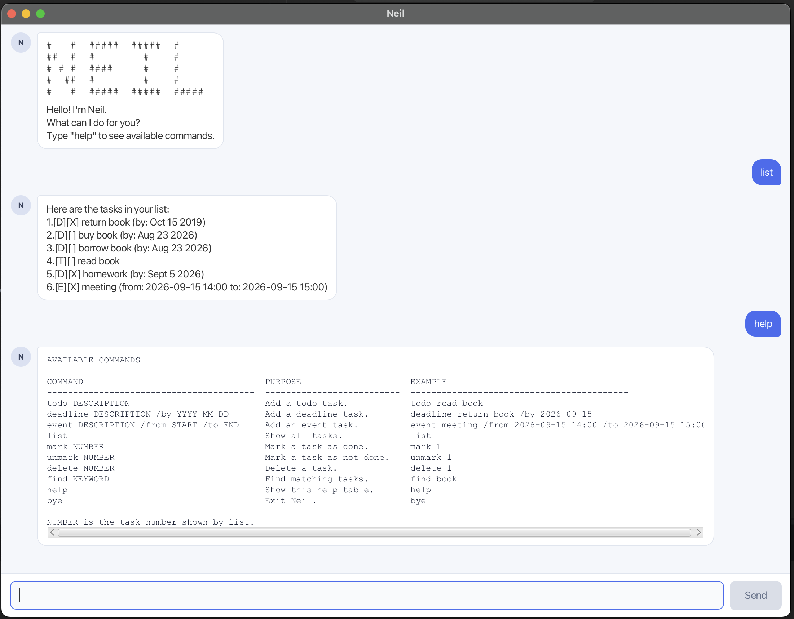

# Neil User Guide

Neil is a friendly desktop chatbot that helps you keep track of todos, deadlines, and events using simple typed commands.

## Table of contents

- [Quick start](#quick-start)
- [Command format](#command-format)
- [Features](#features)
- [Saving data](#saving-data)
- [Command summary](#command-summary)

## Quick start

1. Ensure that Java 25 or later is installed on your computer.
2. Download the latest `.jar` file from the [Neil releases page](https://github.com/Eddrick-23/ip/releases).
3. Copy the file to the folder you want to use as Neil's home folder.
4. Open a terminal, change to the folder containing the JAR file, and run `java -jar neil.jar`.

   A window similar to the one below should appear in a few seconds.

   

5. Type a command in the box at the bottom and press <kbd>Enter</kbd> or click **Send**. Some commands you can try are:

   - `todo read a book` — adds a todo.
   - `deadline submit report /by 2026-09-20` — adds a deadline.
   - `list` — shows all tasks.
   - `mark 1` — marks the first task as completed.
   - `bye` — exits Neil.

6. Refer to the [Features](#features) section for details of each command.

## Command format

- Words in `UPPER_CASE` are values that you supply.
- Dates use `YYYY-MM-DD`; event times use `YYYY-MM-DD HH:mm` in 24-hour time.
- Commands are case-sensitive, except `bye`.
- `NUMBER` means the task number shown by `list`.
- Task details cannot contain the `|` character because it is reserved for saving data.

## Features

### Adding a todo: `todo`

Adds a task without a date or time.

Format: `todo DESCRIPTION`

Example: `todo read a book`

### Adding a deadline: `deadline`

Adds a task that must be completed by a date.

Format: `deadline DESCRIPTION /by DATE`

Example: `deadline submit report /by 2026-09-20`

### Adding an event: `event`

Adds a task with a start and end time. The start must be earlier than the end.

Format: `event DESCRIPTION /from START /to END`

Example: `event team meeting /from 2026-09-20 14:00 /to 2026-09-20 15:30`

### Viewing tasks: `list`

Shows every task and its number. `[T]`, `[D]`, and `[E]` identify todos, deadlines, and events; `[X]` means completed and `[ ]` means incomplete.

Format: `list`

### Completing and reopening tasks: `mark`, `unmark`

Use the number shown by `list` to update a task's completion status.

- Mark as completed: `mark NUMBER` — for example, `mark 2`
- Mark as incomplete: `unmark NUMBER` — for example, `unmark 2`

### Finding tasks: `find`

Shows tasks whose descriptions contain the given keyword or phrase. Matching is case-insensitive. To update a result, use its task number from `list`.

Format: `find KEYWORD`

Example: `find book`

### Deleting a task: `delete`

Permanently removes a task using the number shown by `list`.

Format: `delete NUMBER`

Example: `delete 2`

### Viewing help: `help`

Shows all commands and example formats inside Neil.

Format: `help`

### Exiting Neil: `bye`

Closes the application.

Format: `bye`

## Saving data

Neil automatically saves changes and reloads them the next time it starts. No manual save command is needed. When run from the project folder, tasks are stored in `data/neil.txt`.

## Command summary

| Action | Command |
| --- | --- |
| Add a todo | `todo DESCRIPTION` |
| Add a deadline | `deadline DESCRIPTION /by YYYY-MM-DD` |
| Add an event | `event DESCRIPTION /from YYYY-MM-DD HH:mm /to YYYY-MM-DD HH:mm` |
| View all tasks | `list` |
| Mark a task completed | `mark NUMBER` |
| Mark a task incomplete | `unmark NUMBER` |
| Find tasks | `find KEYWORD` |
| Delete a task | `delete NUMBER` |
| View help | `help` |
| Exit Neil | `bye` |
